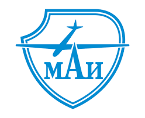

# Aviahackathon2021
### MTS case - Online document singing plugin

  

  

## Overview

Web application for the case "MTS - Online document singing plugin".

It was created using Python & Flask & sqlite3 & S3 Storage provided by Yandex.Cloud.

## Installation

Make sure you have working Python environment & flask. 

To install application, please run:

    pip3 install flask
    python3 "app.py"

To compile it from source:

    git clone https://github.com/kwk18/Aviahackathon2021
    cd Aviahackathon2020/solution/web
    python3 "app.py"

## Example
    
You can see how it works in your browser http://localhost:5000 

## About

Was written by BAGET team for Aviahackathon 2021

##### Notes 
###### please note that "docx_template" path includes some workflows with S3 storage, sqlite3 database, documents, etc.

